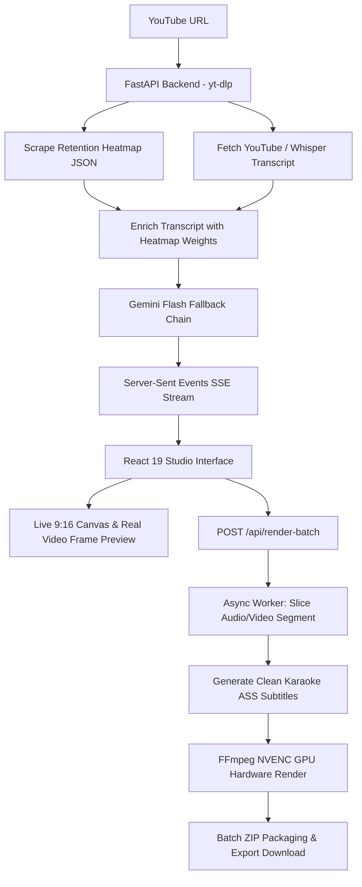

# 🎬 CHEAT CLIP PRO

> **All-in-One AI YouTube Viral Clipper, 9:16 Video Studio & Batch Rendering Engine** — Turn long-form YouTube videos, podcasts, and livestreams into viral Full HD Shorts, Reels, and TikToks with animated karaoke captions, face tracking, and GPU hardware acceleration in minutes.

[](#)
[](https://react.dev/)
[](https://fastapi.tiangolo.com/)
[](https://ffmpeg.org/)
[](https://aistudio.google.com/)
[](LICENSE)

---

## 🧭 Table of Contents

- [🚀 Evolution: What Makes Cheat Clip PRO Different?](#-evolution-what-makes-cheat-clip-pro-different)
- [✨ Core Capabilities](#-core-capabilities)
- [⚡ Quick Start](#-quick-start)
- [🔑 How to Get a Free Google Gemini API Key](#-how-to-get-a-free-google-gemini-api-key)
- [🎯 Complete Creator Workflow](#-complete-creator-workflow)
  - [1. AI Video Analysis & Viral Hook Discovery](#1-ai-video-analysis--viral-hook-discovery)
  - [2. Live Framing Studio & Styling](#2-live-framing-studio--styling)
  - [3. Batch Rendering & One-Click ZIP Export](#3-batch-rendering--one-click-zip-export)
  - [4. YouTube Cookies Management](#4-youtube-cookies-management)
  - [5. Raw Full Video Downloader](#5-raw-full-video-downloader)
- [🛠️ Troubleshooting & FAQ](#️-troubleshooting--faq)
- [🖥️ Tech Stack & Architecture (For Developers)](#️-tech-stack--architecture-for-developers)
- [📡 Complete API Reference](#-complete-api-reference)
- [📁 Project Structure](#-project-structure)
- [📄 License](#-license)

---

## 🚀 Evolution: What Makes Cheat Clip PRO Different?

The original **Cheat Clip** was a timestamp and audience retention analyzer. **Cheat Clip PRO** is a complete, production-ready video creation suite:

| Feature | Original Cheat Clip | 🎬 Cheat Clip PRO |
|---|---|---|
| **Retention Heatmap Scraping** | ✅ Basic | ✅ High-resolution interactive canvas |
| **AI Hook Analysis** | Single Model | ✅ Multi-model automatic fallback chain (Gemini 2.5 / 2.0 / 1.5 Flash) |
| **Video Production & Slicing** | ❌ None (timestamps only) | ✅ Automatic high-speed download & FFmpeg slicing |
| **Live Framing Studio** | ❌ None | ✅ Interactive 9:16 phone preview with real video playback |
| **Face Tracking & Intelligent Crop** | ❌ None | ✅ OpenCV / MediaPipe face tracking keeps speaker centered |
| **Streamer Presets** | ❌ None | ✅ Split-screen (top facecam + bottom gameplay) & PIP corner cam |
| **Animated Word Captions** | ❌ None | ✅ Karaoke-style ASS subtitles with 7 viral styling presets |
| **Caption Sanitization** | ❌ None | ✅ Strips `[LAUGHTER]`, `[APPLAUSE]`, and noise while keeping punctuation (`.`, `,`, `%`, `&`, `$`, `?`) |
| **Hardware Acceleration** | ❌ None | ✅ NVENC GPU acceleration (`h264_nvenc`) with auto CPU fallback |
| **Batch Render & ZIP Export** | ❌ None | ✅ Concurrent batch rendering queue with single-click `.ZIP` download |
| **Anti-Bot Cookie Support** | ❌ None | ✅ Built-in Netscape cookies editor to bypass YouTube rate limits |
| **Temp Storage Cleanup** | ❌ None | ✅ One-click cache purger with safety guard |

---

## ✨ Core Capabilities

### 📊 1. Audience Retention Heatmap Intelligence
- Scrapes real YouTube player engagement curves to discover exact moments where viewers rewound and replayed the video.
- Combines viewer attention peaks with AI narrative analysis to maximize short-form viral potential.

### 🧠 2. Gemini Multi-Model Fallback Chain
- Queries transcripts with Google Gemini Flash models to extract viral hooks, punchlines, and complete story arcs.
- Automatic fallback hierarchy: if a model hits rate limits or quota thresholds, Cheat Clip PRO seamlessly falls back through newer and older Flash models without failing the analysis.

### 📱 3. Live 9:16 Framing Studio
- Real-time interactive phone wireframe preview reflecting real aspect ratio conversions.
- Real video frame extraction (`/api/clip-frame`) ensures you preview actual video frames instead of generic thumbnails.
- Interactive scrub bar, loop mode, playback speed controller, and sound toggle.

### 👤 4. AI Speaker Tracking & Layout Presets
- **Face Tracking**: Dynamically tracks speaker faces across video frames and crops the horizontal video to keep speakers perfectly centered in vertical format.
- **Aspect Ratios**: 9:16 (Vertical Fullscreen), 1:1 (Square), 4:3, and 16:9 (Letterboxed with black or ambient blurred backdrop).
- **Streamer Presets**: Split-screen mode (top camera + bottom gameplay feed) and Picture-in-Picture (PIP) corner webcam overlay.

### 🎨 5. Karaoke Word-Level Animated Captions
- Advanced SubStation Alpha (`.ass`) rendering with per-word timing and color transitions.
- **7 Viral Presets**: Viral Pop (Lemon Yellow), Beast Punch (Neon Green), Cyber Violet (Magenta), Fire Red, Electric Cyan, Golden Aura, and Clean Minimal.
- **Customizable Fonts**: Built-in high-impact display fonts including *Outfit*, *Montserrat*, *Poppins*, *Roboto*, *Inter*, *Bebas Neue*, *Anton*, and *Impact*.
- **Smart Symbol & Tag Cleaning**: Automatically removes non-speech tags (`[LAUGHTER]`, `[APPLAUSE]`, `[MUSIC]`, `(cheering)`, etc.) and symbols, while preserving numbers and expressive punctuation (`.`, `,`, `%`, `&`, `$`, `?`).

### ⚡ 6. NVENC GPU Acceleration & Batch Render Queue
- High-speed rendering using NVIDIA GPU acceleration (`h264_nvenc`), falling back gracefully to optimized CPU encoding (`libx264`).
- **Batch Render Queue**: Select multiple or all viral clips, launch background rendering, and monitor real-time progress (`⚡ Slicing`, `🧠 Captions`, `🎬 Rendering`, `✅ Done`).
- **One-Click ZIP Export**: Packages all finished vertical Full HD clips into a single `.ZIP` file for fast transfer to your phone or cloud drive.

### 🍪 7. YouTube Cookies & Anti-Bot Protection
- Built-in Netscape cookies manager to bypass YouTube "Sign in to confirm you're not a bot" prompts, age restrictions, and temporary IP throttling.

---

## ⚡ Quick Start

### Prerequisites
- [Node.js](https://nodejs.org/) (v18+)
- [Python](https://www.python.org/downloads/) (v3.10+)
- [FFmpeg](https://ffmpeg.org/download.html) installed and accessible on your system `PATH`
- *(Optional)* NVIDIA GPU with CUDA/NVENC drivers for hardware-accelerated rendering

### Installation

1. **Clone the repository**:
   ```bash
   git clone https://github.com/your-username/cheat-clip-pro.git
   cd cheat-clip-pro
   ```

2. **Install frontend dependencies**:
   ```bash
   npm install
   ```

3. **Install Python backend dependencies**:
   ```bash
   python -m pip install -r backend/requirements.txt
   ```

4. **Start the application**:
   ```bash
   npm run dev
   ```
   Both the Vite frontend (`http://localhost:5173`) and FastAPI backend (`http://localhost:8000`) launch concurrently with live hot-reload.

---

## 🔑 How to Get a Free Google Gemini API Key

Cheat Clip PRO uses Google's AI models to identify high-retention moments. Getting a key is **100% free** and requires **no credit card**:

1. Open **[Google AI Studio](https://aistudio.google.com/)**.
2. Sign in with any Google account.
3. Click the blue **"Get API key"** button (or **"Create API key"**).
4. Select or create a project.
5. Copy the generated key (starts with `AIzaSy...`).
6. Paste it into the **Gemini API Key** field in Cheat Clip PRO. Your key is stored securely in your browser's local storage.

> 💡 **Tip**: You can also type `mock` in the API Key box to test the entire interface and workflow with simulated sample data without an API key!

---

## 🎯 Complete Creator Workflow

### 1. AI Video Analysis & Viral Hook Discovery
1. Paste any YouTube URL into the input field.
2. Choose your target clip duration:
   - `⚡ Short (~15s)` — High-tempo hooks for TikTok & Reels.
   - `🔥 Standard (~30s)` — Balanced story clips for YouTube Shorts.
   - `📖 Extended (~60s)` — Full podcast conversations and debates.
3. *(Optional)* Provide a **Topic Focus Prompt** (e.g. *"Focus on funny moments"* or *"Extract business advice"*).
4. Click **"⚡ Analyze Video with Gemini AI"**. The live retention heatmap and extracted moments appear in seconds.

### 2. Live Framing Studio & Styling
1. Click **"🎨 Open in Clip Studio"** on any analyzed clip.
2. Preview the video in the 9:16 phone mockup:
   - **Aspect Ratio**: Choose Fullscreen 9:16 or Letterbox (16:9, 1:1, 4:3) with Black or Blurred backdrop.
   - **Speaker Framing**: Toggle AI Face Tracking or select Streamer Split / PIP layout.
   - **Title Overlay**: Set custom text or AI suggestion, adjust vertical Y position slider, and set visibility duration (5s, 10s, or entire clip).
   - **Subtitles**: Pick your caption style preset (Viral Pop, Beast Punch, etc.), select font family, and adjust subtitle vertical placement.

### 3. Batch Rendering & One-Click ZIP Export
1. Select the clips you want to export (or click **"Select All"**).
2. Click **"🚀 Batch Render X Clips"**.
3. Watch the **Batch Render Queue** right under the Render Specs card track progress in real time.
4. When finished, click **"📦 Download All Clips (.ZIP)"** to save your ready-to-publish vertical videos.

### 4. YouTube Cookies Management
If YouTube rate-limits video extraction or requires verification:
1. Click the **"🍪 Cookies"** button in the top navigation bar.
2. Export your cookies from your browser in Netscape format (using extensions like *Get cookies.txt LOCALLY*).
3. Paste them into the modal and click **"Save Cookies"**. `yt-dlp` will automatically authenticate all requests.

### 5. Raw Full Video Downloader
Need the full source MP4 for manual editing?
1. Open the Raw Video Downloader tab.
2. Submit the YouTube URL to stream download progress with live speed, byte size, and ETA tracking.
3. Download the full source video directly with one click.

---

## 🛠️ Troubleshooting & FAQ

### ❓ "FFmpeg is not recognized as an internal or external command"
- **Solution:** Download FFmpeg from [gyan.dev/ffmpeg/builds](https://www.gyan.dev/ffmpeg/builds/), extract the archive, and add the `bin/` directory to your system's `PATH` environment variable. Verify by running `ffmpeg -version` in terminal.

### ❓ "Quota limit reached / Error 429 from Gemini"
- **Solution:** Cheat Clip PRO automatically retries across all compatible Flash models (`gemini-2.5-flash`, `gemini-2.0-flash`, `gemini-1.5-flash`). If all free tiers are busy, wait 60 seconds or click **"🔑 Change API Key"** to use a key from another Google account.

### ❓ "YouTube bot detection / Sign in to confirm you're not a bot"
- **Solution:** Open the **"🍪 Cookies"** modal in the top navigation bar and paste your YouTube session cookies. This bypasses bot checks and age restrictions.

### ❓ "Temporary disk space is filling up"
- **Solution:** Click the **"🧹 Clear Temp"** button in the bottom action bar. This safely purges temporary audio/video slices while keeping your rendered MP4 exports completely intact.

---

## 🖥️ Tech Stack & Architecture (For Developers)



| Layer | Technology | Key Source Files |
|---|---|---|
| **Frontend Framework** | React 19 · TypeScript · Vite | [src/App.tsx](file:///e:/PROJECT/CLIPPER/cheat-clip-pro/src/App.tsx) · [src/main.tsx](file:///e:/PROJECT/CLIPPER/cheat-clip-pro/src/main.tsx) |
| **Clip Studio & Framing** | Custom Canvas · HTML5 Video · SVG | [src/components/ClipStudioSection.tsx](file:///e:/PROJECT/CLIPPER/cheat-clip-pro/src/components/ClipStudioSection.tsx) · [src/components/HeatmapTimeline.tsx](file:///e:/PROJECT/CLIPPER/cheat-clip-pro/src/components/HeatmapTimeline.tsx) |
| **Styling & Design System** | Vanilla CSS Dark Theme · Glassmorphism | [src/index.css](file:///e:/PROJECT/CLIPPER/cheat-clip-pro/src/index.css) |
| **Backend API** | Python 3.10+ · FastAPI · Uvicorn | [backend/main.py](file:///e:/PROJECT/CLIPPER/cheat-clip-pro/backend/main.py) |
| **Video Production Engine** | FFmpeg · `yt-dlp` · MediaPipe / OpenCV | [backend/video_engine.py](file:///e:/PROJECT/CLIPPER/cheat-clip-pro/backend/video_engine.py) |
| **Subtitle Engine** | Advanced SubStation Alpha (`.ass`) · Whisper | [backend/video_engine.py](file:///e:/PROJECT/CLIPPER/cheat-clip-pro/backend/video_engine.py) |
| **AI Intelligence** | `google-genai` SDK with auto fallback | [backend/main.py](file:///e:/PROJECT/CLIPPER/cheat-clip-pro/backend/main.py) |
| **Bilingual Localization** | Reactive translations (English / Indonesian) | [src/locales/en.ts](file:///e:/PROJECT/CLIPPER/cheat-clip-pro/src/locales/en.ts) · [src/locales/id.ts](file:///e:/PROJECT/CLIPPER/cheat-clip-pro/src/locales/id.ts) |

---

## 📡 Complete API Reference

The backend runs on `http://localhost:8000` with interactive Swagger docs at `http://localhost:8000/docs`:

### Analysis & Models
- `GET /api/health` — Checks backend health and server readiness.
- `GET /api/models?api_key=...` — Lists all available Google Gemini Flash models compatible with the key.
- `POST /api/analyze` — Streams SSE progress while scraping retention heatmaps and extracting viral clips.

### Video Rendering & Studio
- `POST /api/render-batch` — Queues background rendering of selected clips into 1080×1920 Full HD MP4s.
- `GET /api/render-progress/{batch_id}` — Returns SSE or polling status for each clip in the batch.
- `GET /api/download-rendered/{file_name}` — Streams finished vertical MP4 video files.
- `GET /api/download-batch-zip/{batch_id}` — Downloads all finished clips in a batch as a `.ZIP` archive.
- `GET /api/clip-frame?video_id=...&timestamp=...` — Returns an extracted JPEG frame from the real video at timestamp for live preview framing.

### Cookies & Raw Video
- `GET /api/cookies` — Checks status and domain previews of current YouTube cookies.
- `POST /api/cookies` — Saves Netscape cookies text to bypass YouTube bot blocks.
- `DELETE /api/cookies` — Deletes saved cookies file.
- `POST /api/download-raw-video` — Starts full raw video background download with progress monitoring.
- `GET /api/download-raw-status/{job_id}` — Returns speed, ETA, and progress for full video download.

### Storage & Maintenance
- `GET /api/temp-storage-info` — Returns file count and formatted size of temporary cache directories.
- `POST /api/clear-temp` — Safely deletes temporary audio/video slices and resets cache folders.

---

## 📁 Project Structure

```text
cheat-clip-pro/
├── backend/
│   ├── main.py              # FastAPI endpoints, background tasks, model fallbacks
│   ├── video_engine.py      # FFmpeg renderer, ASS generator, face tracking, yt-dlp slicer
│   ├── requirements.txt     # Python backend dependencies
│   ├── fonts/               # Embedded fonts (Outfit, Montserrat, Poppins, etc.)
│   ├── exports/             # Rendered MP4 clips and batch ZIP archives
│   ├── temp/                # Sliced raw clips, ASS subtitle scripts, frame buffers
│   └── cookies.txt          # Netscape format YouTube session cookies (optional)
├── src/
│   ├── App.tsx              # Main dashboard, state orchestration, video analysis view
│   ├── components/
│   │   ├── ClipStudioSection.tsx       # Live 9:16 Studio preview, framing & batch queue
│   │   ├── ClipStudioModal.tsx         # Studio modal overlay
│   │   ├── HeatmapTimeline.tsx         # Interactive canvas retention curve
│   │   ├── CookiesModal.tsx            # YouTube cookies manager modal
│   │   ├── BatchRenderProgressModal.tsx # Fullscreen render monitor
│   │   └── LanguageSwitcher.tsx        # English / Indonesian toggle
│   ├── locales/
│   │   ├── en.ts            # English translations
│   │   └── id.ts            # Indonesian translations
│   ├── types.ts             # TypeScript interface definitions
│   ├── index.css            # Dark mode design system, animations, phone wireframes
│   └── main.tsx             # React DOM entry point
├── package.json             # Frontend scripts & dependencies
└── vite.config.ts           # Vite server & proxy configuration
```

---

## 📄 License

Distributed under the **MIT License**. See `LICENSE` for details.

<p align="center">
  Crafted with ❤️ for YouTube creators, video editors, and viral short-form producers.
</p>
